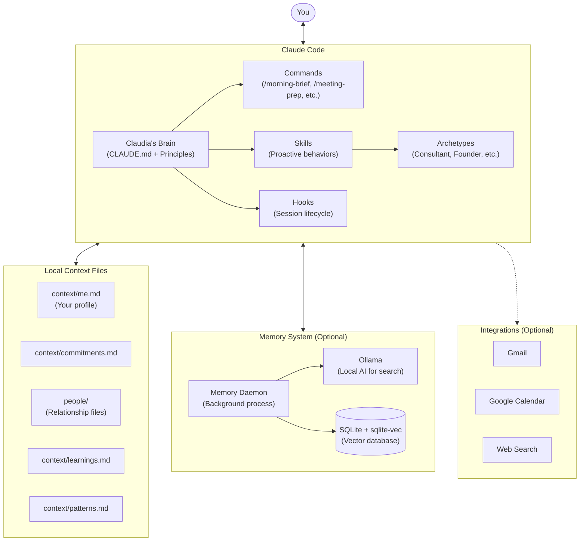
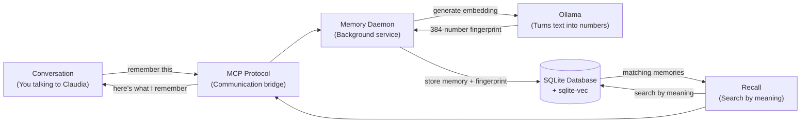
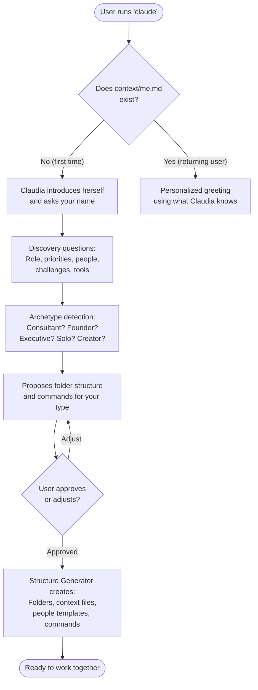

# Architecture

How Claudia works under the hood, explained in plain English.

---

## What Claudia Is

Claudia is an AI executive assistant that runs on [Claude Code](https://docs.anthropic.com/en/docs/claude-code). She is not a traditional application with a backend and a frontend. She is a **template system**: a set of markdown files, folder structures, and behavioral instructions that turn Claude Code into a personalized thinking partner with memory. When you install Claudia, her files get copied to your machine. When you run `claude` inside that folder, Claude reads those files and *becomes* Claudia.

---

## System Overview



**How to read this diagram:**
- **You** talk to Claude Code normally. Claude reads Claudia's brain files and behaves as Claudia.
- **Claudia's Brain** is a set of markdown files that define her personality, behaviors, and rules.
- **Commands** are things you can ask for (like `/morning-brief`). **Skills** are things she does automatically (like catching promises you make).
- **Context Files** live on your machine. They store your profile, commitments, and relationship notes.
- **Memory System** is optional but recommended. It gives Claudia long-term memory that survives across sessions using a local database and AI-powered search.
- **Integrations** connect to external services like Gmail and Google Calendar. They are off by default and require individual setup.

---

## Memory Pipeline

The memory system is what makes Claudia remember things between conversations. Here is how information flows from a conversation into long-term storage and back out again.



**Plain-English explanation of each piece:**

| Component | What it is | What it does |
|-----------|-----------|--------------|
| **Memory Daemon** | A small program running in the background on your computer | Manages storing and retrieving memories. Starts automatically on boot. |
| **MCP Protocol** | A communication standard (Model Context Protocol) | Lets Claude Code talk to the memory daemon. Think of it as a shared language between two programs. |
| **Ollama** | A free, local AI tool | Converts text into a list of 384 numbers (called an "embedding") that capture the *meaning* of the text. Runs entirely on your machine. |
| **sqlite-vec** | An add-on for SQLite | Lets the database search by meaning instead of just exact words. "Find memories similar to X" instead of "find memories containing the word X." |
| **SQLite Database** | A single file on your computer (`~/.claudia/memory/claudia.db`) | Stores all memories, people, patterns, and relationships in a structured format. No server needed. |
| **Embeddings** | Lists of numbers representing meaning | Two sentences with similar meaning produce similar number patterns, even if they use completely different words. This is how Claudia finds relevant memories. |

**What gets stored:**
- **Memories**: Facts, preferences, observations, and learnings (e.g., "Sarah prefers email over Slack")
- **Entities**: People, organizations, projects, and concepts
- **Relationships**: How entities connect (works_with, manages, client_of)
- **Patterns**: Recurring behaviors detected over time
- **Episodes**: Summaries of past conversation sessions

**Background maintenance:**
The daemon runs three scheduled jobs via APScheduler:
- **Daily decay** (2 AM) - Importance of old memories gradually decays so recent things surface first
- **Pattern detection** (every 6 hours) - Detects cooling relationships, overdue commitments, and cross-entity patterns
- **Full consolidation** (3 AM) - Decay + near-duplicate merging + pattern detection in one pass

---

## Onboarding Flow

When someone installs Claudia and runs `claude` for the first time, here is what happens.



**Key design decision:** Claudia does not dump a massive folder structure on you at install. She starts with almost nothing, learns who you are, and *then* generates structure that fits your actual work. A consultant gets client folders and proposal commands. A founder gets investor folders and runway commands. The structure matches the person.

---

## Component Reference

### Claudia's Brain

These are the files that define who Claudia is. Claude Code reads them at the start of every session.

| File | What it does |
|------|-------------|
| `CLAUDE.md` | Claudia's core identity: personality, mission, behaviors, onboarding flow, commands list, and file locations. This is the most important file. |
| `.claude/rules/claudia-principles.md` | Ten behavioral principles that are always active: safety first, honesty about uncertainty, warmth without servility, progressive complexity, and more. |
| `.claude/hooks/` | Event handlers that trigger on session start and end (e.g., loading context files when a session begins). |

### Commands

Commands are things you type to get something done. They live in `.claude/commands/` and are invoked with a `/` prefix.

**Core commands (available to everyone):**

| Command | What it does |
|---------|-------------|
| `/morning-brief` | Shows what needs attention today: commitments, meetings, warnings, overdue items |
| `/meeting-prep [person]` | One-page briefing before a call, pulling in relationship history and open items |
| `/capture-meeting` | Processes meeting notes into decisions, commitments, blockers, and follow-ups |
| `/what-am-i-missing` | Surfaces risks: overdue commitments, cooling relationships, upcoming deadlines |
| `/weekly-review` | Guided weekly reflection across relationships, commitments, and patterns |
| `/new-person [name]` | Creates a relationship file for someone you work with |
| `/follow-up-draft [person]` | Drafts a post-meeting thank-you or summary email |
| `/draft-reply` | Helps draft email responses using available context |
| `/summarize-doc` | Generates an executive summary of any document |
| `/growth-check` | Monthly or quarterly self-development reflection |
| `/pipeline-review` | Reviews your business pipeline across clients and prospects |
| `/financial-snapshot` | Overview of financial status across engagements |
| `/client-health` | Health check across all active client relationships |
| `/accountability-check` | Audits open commitments and follow-through rates |

**Archetype-specific commands** are generated during onboarding based on your work style (see Archetypes below).

### Skills

Skills are proactive behaviors that activate automatically based on context. You never invoke them directly.

| Skill | What it does | When it activates |
|-------|-------------|-------------------|
| **Onboarding** | Runs the first-time discovery flow | No `context/me.md` found |
| **Structure Generator** | Creates personalized folders, files, and commands | After onboarding is approved |
| **Structure Evolution** | Suggests structural improvements over time | As usage patterns emerge |
| **Relationship Tracker** | Surfaces relevant context about people | Someone's name is mentioned |
| **Commitment Detector** | Catches promises you make in conversation | Phrases like "I'll...", "by Friday", etc. |
| **Pattern Recognizer** | Notices recurring themes and trends | Themes repeat across conversations |
| **Risk Surfacer** | Warns about potential problems early | Overdue items, neglected relationships |
| **Capability Suggester** | Suggests new commands or workflows | Repeated manual behaviors detected |
| **Connector Discovery** | Suggests useful introductions between contacts | Relationship context suggests a match |
| **Memory Manager** | Handles saving and loading context between sessions | Session start and end |

### Archetypes

During onboarding, Claudia detects which type of professional you are and tailors her setup accordingly.

| Archetype | Detection signals | What you get |
|-----------|------------------|-------------|
| **Consultant/Advisor** | Multiple clients, proposals, engagements, deliverables | Client folders, engagement tracking, proposal commands |
| **Executive/Manager** | Direct reports, initiatives, board meetings, leadership | Reports folders, initiative tracking, 1-on-1 prep commands |
| **Founder/Entrepreneur** | Investors, fundraising, team building, product roadmap | Investor folders, runway tracking, pitch prep commands |
| **Solo Professional** | Mix of clients and projects, self-directed work | Client and project folders, revenue tracking commands |
| **Content Creator** | Audience building, content calendar, collaborations | Content folders, audience insights, draft commands |

### Integrations

Claudia connects to external services through **MCP (Model Context Protocol)** servers. Configuration lives in `.mcp.json` at your Claudia project root.

| Integration | What it provides | Required? |
|-------------|-----------------|-----------|
| **Memory Daemon** | Long-term memory with semantic search | Optional (recommended) |
| **Gmail** | Read, search, and draft emails | Optional |
| **Google Calendar** | View your schedule | Optional |
| **Brave Search** | Web search capability | Optional |
| **Filesystem** | Read files from specified folders | Optional |

**Important notes:**
- Claudia works fully without any integrations. The core value is relationships and context.
- All integrations are read-only by default. Actions (sending emails, creating events) always require your explicit approval.
- Each integration requires its own setup (API keys, OAuth, etc.). None are active by default.

### Memory System

See the [Memory Pipeline](#memory-pipeline) section above for the full technical explanation.

**With the memory daemon installed:**
- Claudia remembers facts, preferences, and learnings across sessions
- Search works by meaning, not just keywords
- Patterns are detected automatically over time
- Memory importance decays naturally so recent things surface first

**Without the memory daemon (markdown fallback):**
- Context is stored in local markdown files (commitments.md, learnings.md, etc.)
- Claudia reads these at session start and writes updates at session end
- No semantic search, but basic persistence works
- Still fully functional for day-to-day use

---

## Project Files

A complete map of what lives where in this repository.

```
claudia/
├── bin/
│   └── index.js                  # NPM installer CLI (what runs when you type npx get-claudia)
├── package.json                  # NPM package configuration
├── template-v2/                  # Current template (copied to your machine on install)
│   ├── CLAUDE.md                 # Claudia's core identity and behavior
│   └── .claude/
│       ├── commands/             # User-invocable commands (/morning-brief, etc.)
│       ├── skills/               # Proactive behavior definitions
│       │   └── archetypes/       # Archetype-specific configurations
│       ├── rules/                # Behavioral principles (always active)
│       └── hooks/                # Session lifecycle event handlers
├── template/                     # Legacy template (deprecated, kept for reference)
├── memory-daemon/                # Source code for the memory system
│   ├── claudia_memory/           # Python package
│   │   ├── __main__.py           # Entry point
│   │   ├── config.py             # Settings and defaults
│   │   ├── database.py           # SQLite management with crash safety
│   │   ├── embeddings.py         # Ollama embedding generation
│   │   ├── schema.sql            # Database table definitions
│   │   ├── mcp/
│   │   │   └── server.py         # MCP protocol implementation
│   │   ├── daemon/
│   │   │   ├── scheduler.py      # Background task scheduling
│   │   │   └── health.py         # HTTP health check endpoint
│   │   ├── extraction/
│   │   │   └── entity_extractor.py  # Named entity recognition
│   │   └── services/
│   │       ├── remember.py       # Store memories
│   │       ├── recall.py         # Search memories
│   │       └── consolidate.py    # Memory decay and pattern detection
│   ├── scripts/
│   │   └── install.sh            # Memory system setup script
│   ├── pyproject.toml            # Python project configuration
│   └── requirements.txt          # Python dependencies
├── assets/                       # Banner art and demo assets
├── CHANGELOG.md                  # Release history
├── README.md                     # User-facing documentation
├── CONTRIBUTING.md               # Contribution guidelines
├── CODE_OF_CONDUCT.md            # Community standards
├── SECURITY.md                   # Security policy
├── LICENSE                       # Apache License 2.0
└── NOTICE                        # Attribution
```

**When installed on your machine**, Claudia also creates:

```
~/.claudia/                       # Memory system home (if installed)
├── daemon/                       # Memory daemon runtime
│   ├── venv/                     # Python virtual environment
│   └── claudia_memory/           # Daemon source code
├── memory/
│   └── claudia.db                # Your memory database (SQLite)
├── vault/                        # Obsidian vault (PARA structure)
│   └── {project_hash}/          # Per-project vault
├── config.json                   # Memory system settings
└── daemon.log                    # Activity log
```

---

## Design Principles

A few decisions that shaped the architecture:

1. **Template, not application.** Claudia is markdown files, not compiled code. This means you can read, edit, or delete anything she knows. No black boxes.

2. **Local first.** Your context files, memory database, and relationship notes live on your machine. Conversations are processed through Claude's API, but your personal data stays local.

3. **Progressive complexity.** Claudia starts nearly empty and grows to fit how you work. She never dumps a massive system on you upfront.

4. **Relationships over tasks.** People are the primary organizing unit. Projects and tasks come and go. Relationships persist.

5. **Safety by default.** Every external action (sending emails, scheduling meetings) requires your explicit approval. No exceptions.

6. **Memory with meaning.** The memory system searches by meaning, not keywords. "What do I know about Sarah's communication style?" finds relevant memories even if they never use the word "communication."
