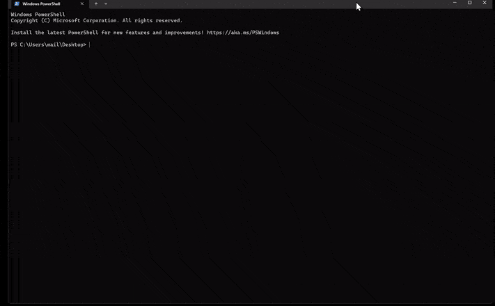

<p align="center">

</p>

<p align="center">
  <a href="https://github.com/kbanc85/claudia/stargazers"></a>
  <a href="https://www.npmjs.com/package/get-claudia"></a>
  <a href="https://github.com/kbanc85/claudia/blob/main/LICENSE"></a>
  <a href="https://nodejs.org"></a>
  <a href="https://python.org"></a>
</p>

<h3 align="center">An AI thinking partner who learns how you work.</h3>

<p align="center">
<em>"Busy work is my job. Judgment is yours."</em>
</p>

<p align="center">
Created by <a href="https://github.com/kbanc85">Kamil Banc</a> · <a href="https://x.com/kamilbanc">@kamilbanc</a> · <a href="https://aiadopters.club">AI Adopters Club</a>
</p>

---

## The Problem

You finish a call and forget to follow up. You promise a deliverable on Friday and lose track of it by Wednesday. You meet someone important, and three weeks later you can't remember what you talked about. You juggle four clients, two projects, and a growing pipeline, and the context lives scattered across notes, emails, and your memory.

AI tools can draft emails and summarize documents. But none of them actually *know* you. None of them remember last Tuesday's conversation, track the commitment you made to Sarah, or warn you that you haven't talked to your best client in three weeks.

That's the gap Claudia fills.

---

## What Is Claudia?

Claudia is an open-source AI thinking partner that runs inside [Claude Code](https://docs.anthropic.com/en/docs/claude-code). She remembers your conversations, tracks your relationships, catches commitments you make, and adapts to match how you actually work.

Not a chatbot. Not a task manager. Not another inbox. She's a thinking partner with memory that compounds over time.

Everything runs locally. Your data stays on your machine.

---

## See It in Action

```
Claudia: Hey there. I'm Claudia. What's your name?

You:     Sarah

Claudia: Nice to meet you, Sarah. What do you do?

You:     I'm a fractional CMO. I work with 4 clients right now.

Claudia: Got it. What are your top priorities?

You:     Client deliverables, growing my pipeline, and not dropping balls

Claudia: Based on what you've shared, here's how I'd organize things:

         clients/         [one folder per client]
         people/          [key relationships]
         context/         [commitments, waiting-on items]

         And I'll set up commands for your work:
         /morning-brief, /client-status, /meeting-prep

         Want me to create this?

You:     Yes, do it

Claudia: Done. Try '/morning-brief' tomorrow, or tell me about a client.
```

From here, every conversation builds on the last. She remembers.

---

## Quick Start

```bash
npx get-claudia
```

<p align="center">

</p>

The installer walks you through everything: creates your workspace, installs the memory system, and optionally sets up a local language model. Then:

```bash
cd claudia
claude
```

Say hi. She'll introduce herself and learn about you in a natural conversation. Within a few sessions, she'll have a personalized workspace, commands, and workflows tailored to your role.

**Requirements:** [Claude Code](https://docs.anthropic.com/en/docs/claude-code), Node.js 14+, Python 3.10+ (for memory)

**Already have Claudia?** Upgrade from any version:
```bash
cd your-claudia-directory
npx get-claudia .
```

This upgrades framework files while preserving your data (context/, people/, projects/).

---

## What She Actually Does

Claudia isn't a list of features. She's a set of outcomes:

- **Catches your commitments.** Say "I'll send that proposal by Friday" in conversation, and she'll track it. On Friday morning, she'll remind you.
- **Remembers your relationships.** Mention Sarah from Acme, and Claudia surfaces what she knows: last conversation, open commitments, communication frequency, sentiment. Ask about one person, and she'll show you their connected network of people and projects.
- **Warns you before things slip.** Haven't talked to your best client in three weeks? Overdue on a deliverable? She surfaces it without being asked.
- **Processes your meetings.** Paste a transcript. She pulls out decisions, action items, and follow-ups, then stores the transcript as a document linked to participants and memories.
- **Shows her work.** Every fact traces back to its source. Ask "how do you know that?" and Claudia shows the email, transcript, or conversation it came from.
- **Adapts to how you work.** She notices patterns ("You draft LinkedIn posts almost daily. Want me to add a quick command for that?") and suggests improvements to her own workflow.

---

## Who It's For

Claudia detects your work style during setup and generates structure that fits:

- **Consultant** -- Multiple clients, deliverables, proposals, pipeline tracking
- **Executive** -- Direct reports, initiatives, leadership, board prep
- **Founder** -- Investors, team, product, fundraising cycles
- **Solo Professional** -- Mix of clients and projects, wearing many hats
- **Creator** -- Audience growth, content calendar, collaborations

Each gets custom folder structures, commands, and templates.

---

## How She Gets Smarter

Claudia suggests improvements as she learns your patterns:

> "I notice you draft LinkedIn posts almost daily. Want me to add a `/linkedin-quick` command?"

> "You often ask about project status on Mondays. Should I add that to your morning brief?"

> "You've mentioned being stretched thin in three conversations this week."

She challenges constructively, surfaces what you might be missing, and adapts her structure to fit how your work actually evolves.

---

## Privacy and Safety

- **Fully local.** Memory, embeddings, and cognitive tools run on your machine. No external APIs for data storage.
- **No external actions without approval.** Every email, calendar event, and external action requires your explicit "yes." Non-negotiable, enforced at the framework level.
- **Your data is yours.** Memories live in `~/.claudia/memory/` as SQLite databases. Documents live in `~/.claudia/files/`. Context lives in readable markdown files. Delete anything, anytime.

---

## How It Works

Claudia has two layers:

**Template layer** (markdown) defines who she is. Skills, commands, rules, and identity files that Claude reads on startup. This is what makes her Claudia rather than generic Claude.

**Memory system** (Python) defines what she remembers. A daemon running locally with SQLite, vector embeddings, and three service layers:

- **Remember** -- stores facts, entities, and relationships with embeddings for semantic search
- **Recall** -- retrieves memories using hybrid ranking (vector similarity + importance + recency)
- **Consolidate** -- runs in the background: decaying old memories, detecting patterns, generating predictions

```
You talk to Claude Code
    |
    v
Claude reads Claudia's template files (skills, commands, rules)
    |
    v
Claude becomes Claudia: personality, proactive behaviors, safety principles
    |
    v
Claudia calls memory tools via MCP (remember, recall, about, file, documents, briefing)
    |
    v
Memory daemon processes locally: SQLite + vector search + Ollama
    |
    v
Everything stays on your machine
```

For full technical diagrams, see [ARCHITECTURE.md](ARCHITECTURE.md).

---

## Key Commands

| Command | What It Does |
|---------|-------------|
| `/morning-brief` | What needs attention today: commitments, meetings, warnings |
| `/meeting-prep [person]` | One-page briefing before a call |
| `/capture-meeting` | Process notes into decisions, commitments, action items |
| `/memory-audit` | See everything Claudia knows, with source chains |
| `/what-am-i-missing` | Surface risks, overdue items, cooling relationships |
| `/weekly-review` | Guided reflection across relationships and projects |
| `/accountability-check` | Outstanding commitments and waiting-on items |

<details>
<summary>All commands</summary>

| Command | What It Does |
|---------|-------------|
| `/draft-reply` | Email response drafts in your voice |
| `/follow-up-draft [person]` | Post-meeting thank-you and summary |
| `/new-person [name]` | Create a relationship file |
| `/pipeline-review` | Active deals, capacity, pipeline health |

</details>

---

## Advanced: Memory System

Claudia's memory goes beyond chat history. She stores facts, preferences, commitments, and observations in a local SQLite database with 384-dimensional vector embeddings (via [Ollama](https://ollama.com) and the all-minilm:l6-v2 model).

**Semantic search** uses hybrid ranking: 50% vector similarity, 25% importance, 10% recency, and 15% full-text search. Accessing a memory boosts it (rehearsal effect), so frequently referenced facts stay prominent.

**Document storage** keeps files, transcripts, and emails on disk and linked to people and memories. Each document has a lifecycle (active, dormant, archived) managed automatically. Files are deduplicated by content hash.

**Provenance chains** trace any fact back to the email, transcript, or conversation it came from. Run `/memory-audit [person]` to see every memory with its source chain.

**Graph traversal** connects the dots across your network. Ask about one person, and Claudia shows related entities with their top memories, using graph walks across the relationship table.

**Compact briefing** keeps session startup lightweight (~500 tokens) with counts and highlights instead of dumping full context. Full data is pulled on demand during conversation.

**Per-project isolation** keeps work memories separate from personal projects. Each workspace gets its own database, keyed by folder path hash.

**Session narratives** capture tone, emotional context, and unresolved threads, so Claudia understands not just what happened but how the conversation felt.

**Eight built-in skills** activate automatically based on context:

| Skill | What It Does |
|-------|-------------|
| **Commitment Detector** | Catches promises in conversation. "I'll send that by Friday" triggers tracking |
| **Relationship Tracker** | Surfaces context when people are mentioned. Tracks contact frequency, sentiment |
| **Pattern Recognizer** | Notices recurring themes after 3+ observations |
| **Risk Surfacer** | Warns about overdue items, cooling relationships, capacity issues |
| **Memory Manager** | Handles session startup, shutdown, and cross-session persistence |
| **Capability Suggester** | Notices repeated tasks and offers to create commands for them |
| **Onboarding** | First-run discovery that generates your personalized workspace |
| **Structure Generator** | Creates folder structures and commands matched to your archetype |

---

## Advanced: Cognitive Tools

Paste a meeting transcript or email. Instead of Claude parsing it token by token, a local language model extracts structured data (entities, facts, commitments, action items) in seconds. Claude then reviews the output and applies judgment.

- Runs locally via [Ollama](https://ollama.com), no API keys needed
- Choose your model during install: Qwen3-4B (recommended), SmolLM3-3B, or Llama 3.2-3B
- Falls back gracefully when no model is installed (Claude handles extraction directly)

Four specialized extraction modes: **meeting** (participants, decisions, action items), **email** (sender, recipients, tone, action items), **document** (key points, entities, relationships), and **general** (facts, commitments, entities).

---

## System Requirements

| Component | Required | Purpose |
|-----------|----------|---------|
| [Claude Code](https://docs.anthropic.com/en/docs/claude-code) | Yes | Runtime for Claudia |
| Node.js 14+ | Yes | NPM installer |
| Python 3.10+ | Recommended | Memory system daemon |
| [Ollama](https://ollama.com) | Recommended | Local embeddings + cognitive tools |

The memory system and Ollama are optional. Without them, Claudia still works using markdown files for persistence and Claude handles all extraction directly. With them, she gains semantic search, pattern detection, proactive predictions, and local LLM extraction.

**Supported platforms:** macOS, Linux, Windows

---

## Troubleshooting

**Memory tools not appearing?**
```bash
# Run the diagnostic script
~/.claudia/diagnose.sh

# Common fixes:
# 1. Restart Claude Code in a NEW terminal (reads .mcp.json at startup)
# 2. Check daemon health: curl http://localhost:3848/health
# 3. View logs: tail -f ~/.claudia/daemon-stderr.log
```

**Ollama not running after reboot?**
```bash
launchctl load ~/Library/LaunchAgents/com.ollama.serve.plist
# Or start manually: ollama serve
```

**Pull models manually**
```bash
ollama pull all-minilm:l6-v2    # Embeddings (required for vector search)
ollama pull qwen3:4b             # Cognitive tools (optional)
```

**Vector search not working?**
```bash
~/.claudia/daemon/venv/bin/python -c "import sqlite_vec; print('ok')"
# If not: ~/.claudia/daemon/venv/bin/pip install sqlite-vec
```

---

## Contributing

Claudia is open source under Apache 2.0. Contributions welcome.

- **Template changes:** Edit files in `template-v2/`. Changes apply to new installations.
- **Memory system:** Python code in `memory-daemon/`. Run tests with `pytest tests/`.
- **Architecture overview:** See [ARCHITECTURE.md](ARCHITECTURE.md) for the full system design.
- **Development guide:** See [CLAUDE.md](CLAUDE.md) for the developer workflow.

---

## License

Apache 2.0

---

## Credits

Created by [Kamil Banc](https://github.com/kbanc85) · [@kamilbanc](https://x.com/kamilbanc)

Part of the [AI Adopters Club](https://aiadopters.club) -- helping teams build AI-first reflexes.

If Claudia helps you, a star on GitHub means a lot.

---

<p align="center">
<em>"I learn how you work. Let's get started."</em>
</p>
