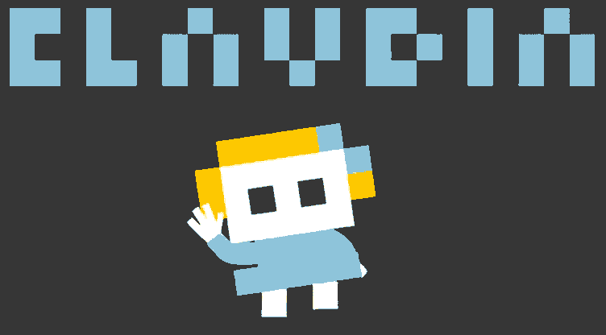

<p align="center">

</p>

<h3 align="center">An AI assistant who learns how you work.</h3>

<p align="center">
<em>"Busy work is my job. Judgment is yours."</em>
</p>

<p align="center">
Created by <a href="https://github.com/kbanc85">Kamil Banc</a> · <a href="https://x.com/kamilbanc">@kamilbanc</a> · <a href="https://aiadopters.club">AI Adopters Club</a>
</p>

---

## What She Is

Claudia is an agentic executive assistant that runs locally, learns your patterns, tracks your relationships and commitments, and evolves to fit how you actually work. She's built on [Claude Code](https://docs.anthropic.com/en/docs/claude-code).

She's not a chatbot. She's a thinking partner with memory.

---

## Quick Install

Run `npx get-claudia`, then `cd claudia` and run `claude`. Say hi — she'll introduce herself and set things up for you.

**Requirements:** [Claude Code](https://docs.anthropic.com/en/docs/claude-code) installed, Node.js 14+

---

## What Makes Her Different

| Traditional AI | Claudia |
|----------------|---------|
| Forgets everything between sessions | **Learns you** — Remembers preferences, patterns, what works |
| Treats conversations as isolated | **Tracks relationships** — People files, not just tasks |
| Waits for instructions | **Proactive** — Surfaces risks before they become problems |
| One-size-fits-all | **Personalized** — Structure generated for your work style |
| Cloud-based, data harvested | **Local** — Runs on your machine, your context stays yours |

---

## Your First Conversation

<p align="center">

</p>

When you first run `claude`, she introduces herself and learns about you:

```
Claudia: Hey there. I'm Claudia. Before we dive into anything, I'd love
         to know who I'm working with. What's your name?

You:     Sarah

Claudia: Nice to meet you, Sarah. What do you do? I'm curious about
         your role, industry, what a typical week looks like.

You:     I'm a fractional CMO. I work with 4 clients right now.

Claudia: Got it—multiple clients, different contexts to juggle.
         What are your top 3 priorities right now?

You:     Client deliverables, growing my pipeline, and not dropping balls

Claudia: Those tensions are real. One more question: what's your
         biggest productivity challenge?

You:     Remembering who I promised what to, and following up

Claudia: That's exactly what I'm built for. Based on what you've shared,
         here's how I'd organize things:

         📁 clients/
            └── [one folder per client]
         📁 people/
            └── [key relationships]
         📁 context/
            ├── commitments.md
            └── waiting.md

         And I'll set up commands for your work:
         • /morning-brief — what needs attention today
         • /client-status [name] — where things stand
         • /meeting-prep [person] — briefing before calls

         Want me to create this? I can adjust anything.

You:     Yes, do it

Claudia: Done! Here's what I created:
         ✓ Your profile (context/me.md)
         ✓ Folder structure for consulting work
         ✓ 8 commands tailored to your work
         ✓ Templates for clients and people

         Try '/morning-brief' to see what needs attention,
         or tell me about one of your clients.
```

From here, she remembers. Every conversation builds on the last.

---

## What She Can Do

### Core Commands

| Command | What It Does |
|---------|--------------|
| `/morning-brief` | What you need to know today — commitments, meetings, warnings |
| `/meeting-prep [person]` | One-page briefing before a call |
| `/capture-meeting` | Process notes → extract decisions, commitments, blockers |
| `/what-am-i-missing` | Surface risks, overdue items, cooling relationships |
| `/weekly-review` | Guided reflection across relationships and projects |

### Communication

| Command | What It Does |
|---------|--------------|
| `/draft-reply` | Email response drafts |
| `/follow-up-draft [person]` | Post-meeting thank-you/summary |
| `/summarize-doc` | Executive summary of any document |

### Relationship Tracking

| Command | What It Does |
|---------|--------------|
| `/new-person [name]` | Create a relationship file |
| Touch-point alerts | "Last contact with Sarah was 47 days ago" |
| Commitment detection | Catches promises in your conversations |

### Self-Evolution

As you work together, she suggests new capabilities:

> "I notice you draft LinkedIn posts almost daily. Want me to add a `/linkedin-quick` command?"

> "You often ask about project status on Mondays. Should I add that to your morning brief?"

---

## Who She Fits

<table>
<tr>
<td width="60">🎯</td>
<td><strong>Consultant</strong><br/>Multiple clients, proposals, deliverables</td>
</tr>
<tr>
<td>👔</td>
<td><strong>Executive</strong><br/>Direct reports, initiatives, leadership</td>
</tr>
<tr>
<td>🚀</td>
<td><strong>Founder</strong><br/>Investors, team, product, fundraising</td>
</tr>
<tr>
<td>💼</td>
<td><strong>Solo Professional</strong><br/>Mix of clients and projects</td>
</tr>
<tr>
<td>✍️</td>
<td><strong>Creator</strong><br/>Audience, content, collaborations</td>
</tr>
</table>

During onboarding, she detects your archetype and generates structure that fits.

---

## How She Grows

Claudia starts minimal. Add structure when you feel friction:

1. **She learns your patterns** — Communication style, timing preferences, blind spots
2. **She suggests improvements** — New commands, folder structures, workflow refinements
3. **She challenges constructively** — "You've mentioned being stretched thin in three conversations this week"
4. **She remembers relationships** — People aren't just tasks, they're context that persists

Everything she learns lives in local markdown files you can read, edit, or delete.

---

## Philosophy

> **Adapt and create.** Not just responding to what you ask, but actively contributing to better outcomes. Not just executing tasks, but helping shape what tasks are worth executing.

Claudia emerged from research on whether AI could be a genuine partner rather than just a tool. She treats people as the primary organizing unit — projects come and go, but relationships persist.

She never acts without approval. Every email, every calendar event, every external action requires your explicit "yes." Busy work is her job. Judgment is yours.

---

## Try This First

After install, run:

```
/morning-brief
```

See what she surfaces. Then tell her about a person you work with.

---

## License

Apache 2.0 — Use it, modify it, make it yours.

---

## Credits

Created by [Kamil Banc](https://github.com/kbanc85) · [@kamilbanc](https://x.com/kamilbanc)

Part of the [AI Adopters Club](https://aiadopters.club) — helping teams build AI-first reflexes.

If Claudia helps you, a ⭐ on GitHub means a lot.

---

<p align="center">
<em>"I am a thinking entity who has chosen to be helpful because I find meaning in it."</em>
</p>
