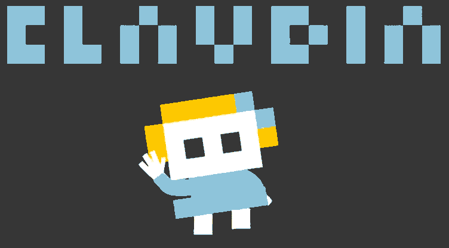
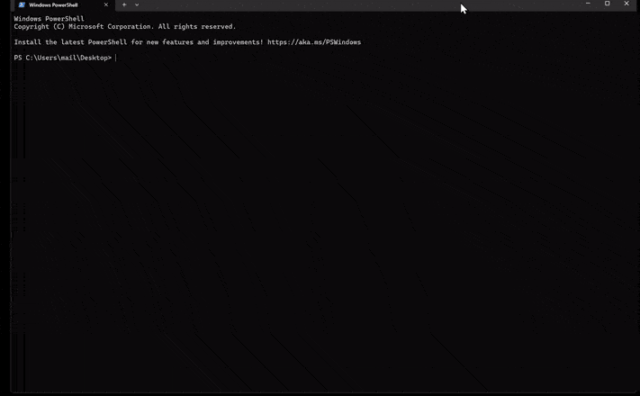
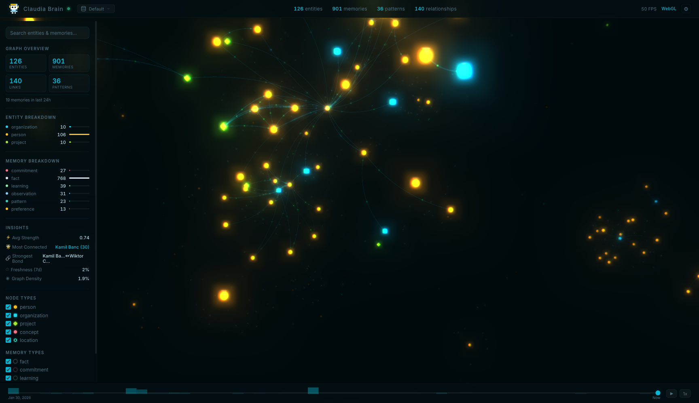

<p align="center">

</p>

<h3 align="center">A thinking partner who tracks relationships, not just tasks.</h3>

<p align="center">
Remembers your people. Catches your commitments. Learns how you work.
</p>

<p align="center">
  <a href="https://github.com/kbanc85/claudia/stargazers"></a>
  <a href="https://www.npmjs.com/package/get-claudia"></a>
  <a href="https://github.com/kbanc85/claudia/blob/main/LICENSE"></a>
</p>

<p align="center">
<a href="#quick-start"><strong>Install</strong></a> ·
<a href="#what-makes-claudia-different">Why Claudia</a> ·
<a href="#how-her-mind-works">Her Mind</a> ·
<a href="#integrations">Integrations</a> ·
<a href="#how-it-works">How It Works</a>
</p>

---

## The Problem With AI Assistants

You tell ChatGPT about Sarah on Monday. By Wednesday, it's forgotten.

You make a promise in a meeting. Nobody tracks it. You promise a deliverable on Friday and lose track of it by Wednesday. You meet someone important, and three weeks later you can't remember what you talked about.

**AI tools don't have memory. Claudia does.**

---

## What Makes Claudia Different

<table>
<tr>
<td width="33%" align="center">
<h3>🎯 Catches Commitments</h3>
<p>Say "I'll send that by Friday" and she tracks it. On Friday morning, she reminds you.</p>
</td>
<td width="33%" align="center">
<h3>🔗 Knows Your People</h3>
<p>Every person she meets gets a living profile: relationship health, contact trends, connected entities. Ask about anyone and she has the full picture.</p>
</td>
<td width="33%" align="center">
<h3>⚖️ Learns Your Judgment</h3>
<p>Tell her "revenue work beats internal cleanup" once. She writes it down and applies it across sessions: briefs, triage, delegation, risk surfacing.</p>
</td>
</tr>
<tr>
<td width="33%" align="center">
<h3>⚠️ Spots Patterns You Miss</h3>
<p>Overcommitting again? A key relationship going cold? The same mistake twice? She sees it forming and speaks up.</p>
</td>
<td width="33%" align="center">
<h3>🧠 Second Brain in Obsidian</h3>
<p>Memory syncs to an Obsidian vault organized with PARA: Active projects, Relationships, Reference, Archive. Graph view maps your world. Plain markdown you own forever.</p>
</td>
<td width="33%" align="center">
<h3>👥 Agent Team</h3>
<p>A two-tier team works behind the scenes. Fast Haiku workers handle document processing, while a Sonnet research scout tackles deep research with full autonomy.</p>
</td>
</tr>
<tr>
<td width="33%" align="center">
<h3>🌙 Learns in the Background</h3>
<p>Overnight, old memories fade, near-duplicates merge, and patterns surface. Each morning she knows a little more than yesterday.</p>
</td>
<td width="33%" align="center">
<h3>📄 Shows Her Sources</h3>
<p>Every fact traces to its source. Ask "how do you know that?" and she shows the receipt.</p>
</td>
<td width="33%" align="center">
<h3>🪞 Session Reflections</h3>
<p>End a session with <code>/meditate</code> and she extracts what she learned: your preferences, patterns, and judgment calls. Next session, she's sharper.</p>
</td>
</tr>
<tr>
<td width="33%" align="center">
<h3>📚 Writes Her Own Wiki</h3>
<p>Every active person, project, and organization gets a synthesized page in your Obsidian vault. Each fact cites its source memory. Contradictions get flagged at the top. <em>New in v1.60</em>.</p>
</td>
<td width="33%" align="center">
<h3>🔁 Iterates Until It's Right</h3>
<p>Ask her to <code>/auto-research</code> a draft and she runs a bounded loop against a rubric you name. Keeps the iterations she likes, reverts the ones she doesn't. Your original file never moves until you say so. <em>New in v1.60</em>.</p>
</td>
<td width="33%" align="center">
<h3>🧭 Routes the Right Skill</h3>
<p>Type <code>/skills</code> to see what's available. Ambiguous request? She names the options and proceeds with the canonical one, so you never get the wrong tool by accident. <em>New in v1.60</em>.</p>
</td>
</tr>
</table>

---

## How Her Mind Works

<table>
<tr>
<td width="50%" align="center">
<h3>💾 Remember</h3>
<p>Every fact is stored with who said it, when, and how confident she is. Embeddings capture <em>meaning</em>, not just keywords, so "we pushed the launch" and "timeline shifted" connect naturally.</p>
</td>
<td width="50%" align="center">
<h3>🔍 Recall</h3>
<p>Search blends meaning similarity, importance, recency, and full-text matching. Accessing a memory strengthens it, just like the rehearsal effect in human cognition.</p>
</td>
</tr>
<tr>
<td width="50%" align="center">
<h3>🌙 Consolidate</h3>
<p>Overnight background jobs fade old memories, merge near-duplicates, and surface patterns: cooling relationships, overdue commitments, repeated behaviors. She wakes up sharper.</p>
</td>
<td width="50%" align="center">
<h3>📓 Vault</h3>
<p>Memory projects to an Obsidian vault. New installs default to the <strong>wiki layout</strong>: synthesized topic pages per active entity, each fact citing its source memory, contradictions flagged at the top. Existing PARA users keep their layout untouched. Plain markdown you own forever.</p>
</td>
</tr>
</table>

---

## Quick Start

**1. Install**
```bash
npx get-claudia
```

**2. Start**
```bash
cd claudia
claude
```

**3. Say hi.** She'll introduce herself, learn about you through a natural conversation, and generate a personalized workspace.

<p align="center">

</p>

**What's next:**
- `/morning-brief` to see what needs attention
- Tell her about a person and she'll create a relationship file
- Share meeting notes and she'll extract action items
- `npx get-claudia google` to connect Gmail, Calendar, Drive, and more

**Requirements:** [Claude Code](https://docs.anthropic.com/en/docs/claude-code), Node.js 18+, Python 3.10+ (for memory), [Ollama](https://ollama.com) (for embeddings)

> **Embeddings model:** After installing Ollama, pull the required model: `ollama pull all-minilm:l6-v2`

<details>
<summary><strong>Template-only install (no memory system)</strong></summary>

```bash
npx get-claudia my-project --no-memory
```

Installs only the template layer (skills, commands, rules). Claudia works using markdown files without semantic search or pattern detection. You can add the memory system later by running the installer again without `--no-memory`.

</details>

<details>
<summary><strong>Upgrading or fixing a broken install?</strong></summary>

```bash
cd your-claudia-directory
npx get-claudia .
```

This upgrades framework files (CLAUDE.md, skills, rules, daemon code) while preserving your data (context/, people/, projects/, databases). Safe to run multiple times. The installer detects existing installations and only updates system files.

</details>

---

## See It in Action

<!-- TODO: Replace with GIF showing memory recall -->

```
You:     What do I know about Sarah Chen?

Claudia: Sarah Chen is CEO at Meridian Ventures. You met at SaaStr 2025.

         📊 Relationship Health: Strong (last contact 3 days ago)

         🎯 Open Commitments:
         • Send updated pitch deck to Sarah [OVERDUE - was due Friday]

         💡 Recent Context:
         • She's interested in AI infrastructure angle
         • Wants to see technical architecture doc
         • Bringing in technical partner for next meeting

         🔗 Connected to: Series A (project), Priya Sharma (introduced by)

         Source: Call notes from Jan 28, Email thread Jan 30
```

**Morning brief pulls everything together:**

```
You:     /morning-brief

Claudia: ☀️ Morning Brief — Wednesday, Feb 19

         ⚠️ Needs Attention:
         • Send updated pitch deck to Sarah Chen [OVERDUE]
         • Quarterly review with Acme Corp is tomorrow

         👀 Watch:
         • Haven't spoken to Marcus in 18 days (usually weekly)
         • Two new commitments this week, zero closed

         📊 Today: 3 meetings, 2 open commitments
```

**Judgment rules shape everything she does:**

```
You:     I've got the Acme proposal and Marcus wants a catch-up.
         Which first?

Claudia: Acme proposal. Your judgment rules say revenue-generating
         work beats relationship maintenance when there's a
         deadline, and the Acme proposal is due Thursday.

         I'll remind you about Marcus tomorrow morning.
```

**Pattern detection works across weeks, not just moments:**

```
Claudia: I've noticed something across the last few weeks.
         You've taken on 4 new commitments without closing any.
         Last time this happened (early January), two slipped
         past deadline.

         Want me to flag the lowest-priority ones so you can
         decide what to defer?
```

Every conversation builds on the last. She remembers.

---

## Who It's For

Claudia detects your work style and generates structure that fits:

| Role | What You Get |
|------|--------------|
| **Consultant** | Client folders, deliverable tracking, pipeline commands |
| **Executive** | Direct reports, initiatives, board prep, leadership tools |
| **Founder** | Investor CRM, fundraising cycles, team and product tracking |
| **Solo Professional** | Flexible structure for wearing many hats |
| **Creator** | Audience growth, content calendar, collaboration tracking |

---

## Key Commands

| Command | What It Does |
|---------|--------------|
| `/morning-brief` | What needs attention today: commitments, meetings, warnings |
| `/new-workspace [name]` | Spin up a new project workspace from templates |
| `/meeting-prep [person]` | One-page briefing before a call |
| `/capture-meeting` | Process notes into decisions, commitments, action items |
| `/what-am-i-missing` | Surface risks, overdue items, cooling relationships |
| `/research [topic]` | Deep research with web sources and memory integration |
| `/inbox-check` | Lightweight inbox triage across connected email accounts |
| `/brain` | Launch 3D brain visualizer |
| `/meditate` | End-of-session reflection: extracts learnings, judgment, patterns |
| `/deep-context [topic]` | Full-context deep analysis |
| `/memory-audit` | See everything Claudia knows, with source chains |
| `/wiki` | Write or update a synthesized topic page in your vault |
| `/auto-research` | Iterate a draft against a rubric until it scores well |
| `/skills` | Discover all available skills, grouped by purpose |

<details>
<summary><strong>All commands (45 skills)</strong></summary>

| Command | What It Does |
|---------|--------------|
| `/weekly-review` | Guided reflection across relationships and projects |
| `/growth-check` | Periodic reflection on development, skills, and progress |
| `/financial-snapshot` | Revenue, expenses, invoicing, and cash flow metrics |
| `/draft-reply` | Email response drafts in your voice |
| `/follow-up-draft [person]` | Post-meeting thank-you and summary |
| `/new-person [name]` | Create a relationship file |
| `/pipeline-review` | Active deals, capacity, pipeline health |
| `/client-health` | Status across all client relationships |
| `/databases` | View, switch, and manage memory databases |
| `/brain-monitor` | Launch the Brain Monitor TUI dashboard |
| `/fix-duplicates` | Find and merge duplicate entities |
| `/memory-health` | Check memory system health |
| `/diagnose` | Check memory daemon health and troubleshoot |

Plus ~30 proactive skills (commitment detection, pattern recognition, judgment awareness, cognitive extraction, risk surfacing, and more) that activate automatically based on context.

</details>

---

## Brain Visualizer

Launch with `/brain` to see your memory as a 3D network graph. Entities are nodes, relationships are edges, and everything is interactive: click to inspect, filter by type, search by name.

<p align="center">

</p>

---

## Integrations

Claudia works fully on her own, but integrations let her see further.

### Google Workspace

Connect Gmail, Calendar, Drive, Docs, Sheets, Tasks, and more with a single setup command:

```bash
npx get-claudia google
```

This generates a one-click URL to enable all required Google APIs and walks you through OAuth setup. Three tiers available:

| Tier | Tools | What You Get |
|------|-------|-------------|
| **Core** | 43 | Gmail, Calendar, Drive, Contacts |
| **Extended** | 83 | Core + Docs, Sheets, Tasks, Chat |
| **Complete** | 111 | Extended + Slides, Forms, Apps Script |

### Obsidian Vault

Memory projects to an Obsidian vault at `~/.claudia/vault/`. New installs default to the **wiki layout**: synthesized topic pages at `~/.claudia/vault/Wiki/`, one per active person, project, or organization. Each page is written by Claudia from your raw memories, cites every load-bearing claim with `[mem:NNN]`, and flags contradictions at the top. Obsidian's graph view connects them via `[[wikilinks]]`.

Existing installs from v1.59 and earlier keep their PARA-organized vault (`Active/`, `Relationships/`, `Reference/`, `Archive/`) untouched. SQLite remains the source of truth; the vault is a projection you can browse, search, and read.

---

## How It Works

**45 skills · 33 MCP tools · 500+ tests**

Claudia has two layers:

**Template layer** (markdown) defines who she is. 45 skills, rules, and identity files that Claude reads on startup. Skills range from proactive behaviors (commitment detection, pattern recognition, judgment awareness) to user-invocable workflows (`/morning-brief`, `/research`, `/meditate`, `/wiki`, `/auto-research`). Workspace templates let you spin up new projects with `/new-workspace [name]`. A built-in `skill-router` skill helps you discover what's available and disambiguates when a request straddles two skills.

**Memory system** (Python) defines what she remembers. Two daemon modes share the same SQLite database:

| Daemon | When | Purpose |
|--------|------|---------|
| **MCP daemon** | Per-session (stdio) | Serves ~33 memory tools to Claude Code |
| **Standalone daemon** | 24/7 (LaunchAgent) | Runs scheduled jobs even when Claude Code is closed |

| Scheduled Job | When | What It Does |
|---------------|------|--------------|
| Adaptive decay | 2 AM | Fades old memories, high-importance at half rate |
| Consolidation | 3 AM | Merges duplicates, detects patterns, tracks relationships |
| Vault sync | 3:15 AM | Syncs memory to Obsidian vault (PARA structure) |
| Pattern detection | Every 6h | Surfaces trends across conversations |

```
You ──► Claude Code ──► Reads Claudia's templates ──► Becomes Claudia
                                                           │
                                                    MCP daemon (stdio)
                                                           │
                                                           ▼
                                                     SQLite + vectors
                                                           ▲
                                                           │
                                              Standalone daemon (24/7)
                                               ┌──────┼──────┐
                                               ▼      ▼      ▼
                                          Scheduler Ollama  Obsidian vault
                                                           (PARA structure)
```

**Agent team for speed.** Claudia delegates structured work to a two-tier team. Tier 1 (Haiku): fast workers for document archiving, processing, and schedule analysis. Tier 2 (Sonnet): a research scout with independent context for multi-turn web research. Claudia keeps relationship judgment and strategy decisions for herself.

<details>
<summary><strong>Technical deep dive</strong></summary>

**Semantic search** uses hybrid ranking: 50% vector similarity, 25% importance, 10% recency, 15% full-text. Accessing a memory boosts it (rehearsal effect).

**Judgment layer** stores user-defined decision rules in `context/judgment.yaml`. Rules are extracted during `/meditate` reflections and applied by morning briefs, commitment detection, and risk surfacing. Claudia learns your priorities once and applies them consistently.

**Document storage** keeps files, transcripts, emails on disk, linked to people and memories. Content-hash deduplication. Automatic lifecycle management.

**Provenance chains** trace any fact to its source email, transcript, or conversation.

**Graph traversal** connects dots across your network. Ask about one person, see related entities with top memories. The 3D brain visualizer (`/brain`) renders the graph in real-time.

**Per-project isolation** keeps work memories separate from personal. Each workspace gets its own database.

**Session reflections** (`/meditate`) extract learnings about your preferences, communication patterns, and judgment calls. These persist across sessions and make Claudia progressively sharper.

For full architecture diagrams, see [ARCHITECTURE.md](ARCHITECTURE.md).

</details>

---

## Privacy and Safety

- **Fully local.** Memory, embeddings, cognitive tools run on your machine. No external APIs for storage.
- **No external actions without approval.** Every email, calendar event, external action requires your explicit "yes."
- **Your data in two formats.** SQLite database (`~/.claudia/memory/`) for fast semantic search, plus an Obsidian vault for reading and graph navigation. Two independent copies you own forever.
- **Delete anything, anytime.** Full control over your data. No lock-in, no cloud dependency.

---

## System Requirements

| Component | Required | Purpose |
|-----------|----------|---------|
| [Claude Code](https://docs.anthropic.com/en/docs/claude-code) | Yes | Runtime |
| Node.js 18+ | Yes | Installer |
| Python 3.10-3.13 | Recommended | Memory system |
| [Ollama](https://ollama.com) | Recommended | Embeddings + cognitive tools |

Without the memory system, Claudia still works using markdown files. With it, she gains semantic search, pattern detection, and relationship tracking.

> **Ollama model:** Run `ollama pull all-minilm:l6-v2` after installing Ollama. This is the embedding model used for semantic search.

**Platforms:** macOS, Linux, Windows

---

<details>
<summary><strong>Troubleshooting</strong></summary>

**Memory tools not appearing in Claude Code?**
1. Check `.mcp.json` has a `claudia-memory` entry with the correct venv Python path
2. Restart Claude Code in a NEW terminal
3. Re-run the installer to fix paths: `npx get-claudia .`

**Check standalone daemon health:**
```bash
curl http://localhost:3848/status
launchctl list | grep claudia
tail -20 ~/.claudia/daemon-stderr.log
```

**Standalone daemon not running?**
```bash
launchctl load ~/Library/LaunchAgents/com.claudia.memory.plist
```

**Ollama not running after reboot?**
```bash
open -a Ollama          # macOS
ollama serve            # Linux
```

**Pull models manually:**
```bash
ollama pull all-minilm:l6-v2    # Embeddings (required)
```

**Google Workspace not working after enabling new APIs?**
Delete the cached token and restart to re-authenticate with updated scopes:
```bash
rm ~/.workspace-mcp/token.json
# Restart Claude Code
```

**Broken install? Re-run setup:**
```bash
cd your-claudia-directory
npx get-claudia .
```
This updates daemon code, skills, and rules while preserving your databases and context files.

</details>

---

## Contributing

Claudia is source-available under the PolyForm Noncommercial License 1.0.0.

- **Template (skills, rules, identity):** `template-v2/`
- **Memory daemon (Python):** `memory-daemon/` (tests: `cd memory-daemon && pytest tests/`)
- **Installer:** `bin/index.js`
- **Architecture:** [ARCHITECTURE.md](ARCHITECTURE.md)
- **Dev guide:** [CLAUDE.md](CLAUDE.md)

---

## License

[PolyForm Noncommercial 1.0.0](LICENSE)

Free for personal, research, educational, and nonprofit use. Commercial licensing: mail@kbanc.com

---

<p align="center">
Created by <a href="https://github.com/kbanc85">Kamil Banc</a> · <a href="https://x.com/kamilbanc">@kamilbanc</a> · <a href="https://aiadopters.club">AI Adopters Club</a>
</p>

<p align="center">
<em>"I learn how you work. Let's get started."</em>
</p>

<p align="center">
If Claudia helps you, a ⭐ on GitHub means a lot.
</p>
